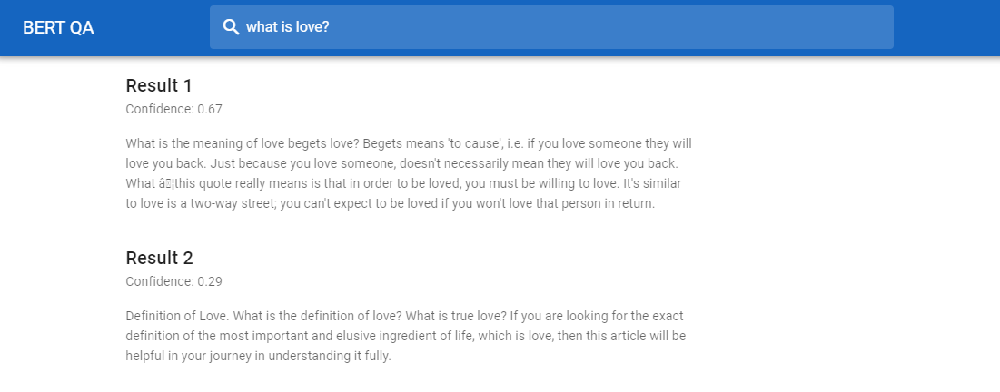

# Information retrieval using BERT and MS Marco Datasets

## Prerequisites

- Docker

- Docker Compose

- Virtualenv


## Training Model from MS Marco Task

You can train a model to accomplish MS Marco task:

### Create the datasets

You need to create a virtualenv:

```bash 
$ cd path/to/marco-polo
$ python3 -m venv env-marco
$ source env-marco/bin/activate/
$ pip3 install -r requirements.txt
```
Run the following commands you just need to be in the main directory of the repository

```bash
$ cd path/to/marco-polo
$ DATA_DIR=./datasets/datasets
$ mkdir ${DATA_DIR}
$ wget https://msmarco.blob.core.windows.net/msmarcoranking/triples.train.small.tar.gz -P ${DATA_DIR}
$ wget https://msmarco.blob.core.windows.net/msmarcoranking/top1000.dev.tar.gz -P ${DATA_DIR}
$ wget https://msmarco.blob.core.windows.net/msmarcoranking/top1000.eval.tar.gz -P ${DATA_DIR} 

$ tar -xvf ${DATA_DIR}/triples.train.small.tar.gz -C ${DATA_DIR}
$ tar -xvf ${DATA_DIR}/top1000.dev.tar.gz -C ${DATA_DIR}
$ tar -xvf ${DATA_DIR}/top1000.eval.tar.gz -C ${DATA_DIR}
```
```bash
$ python -m datasets.gen_tfrecords \
        --output_folder=${DATA_DIR}/tfrecord \
        --train_ds_path=${DATA_DIR}/triples.train.small.tsv \
        --max_seq_length=512
```
And if you prefer, you can also download the tfrecord files yourself, from [here](https://drive.google.com/file/d/1IHFMLOMf2WqeQ0TuZx_j3_sf1Z0fc2-6/view) and copy the files to the specified datasets

### Download pretrained model

You need to download a pretrained BERT model, you can find [here](https://github.com/google-research/bert). If you have a good enough computer and GPU, we will use Bert Base


```bash
$ wget https://storage.googleapis.com/bert_models/2020_02_20/uncased_L-12_H-768_A-12.zip
$ unzip uncased_L-12_H-768_A-12.zip
```

### Fine-tune the model

Afterward, you can fine-tune the model using either the [Kaggle](https://www.kaggle.com/lemartiens/ranking-msmarco/notebook) or locally with scripts available

**Fine-tune the model:**

```bash
$ python3 -m src.train.train_bert --data_dir=/path/to/tfrecord_folder \
                                --output_dir=/path/to/outputdir \
                                --learning_rate=1e-5 \
                                --batch_size=8 \
                                --max_seq_length=512 \
                                --decay_steps=30000 \
                                --warmup_steps=3000 \
                                --weight_decay=1e-3 \
                                --epochs=3 \
                                --steps_per_epoch=40000 \
                                --do_train=True \
                                --do_eval=False \
                                --top_n=10
```
You can do use the model to submit to MS Marco, which I haven't done and wasn't the purpose of this task

## Running the APP

For this part of the project, We will use a BERT Large Finetuned on SQUAD which is really good for Question answering task

### Build Docker

Now, you need to build the Docker, it should build an ElasticSearch and a Flask image

```bash
$ docker-compose up
```

### Index documents

You need to index documents onto the elasticsearch cluster. So, first create the index, it will use the mapping for src/elasticsearch/index.json, specify the right length for the dense vector depending on the size of the BERT Model used:

```bash
$ python3 src/elasticsearch/src/create_index.py
```

It will create an index names "documents" to store our documents from MSMarco dataset, if you haven't download it, do it now !

```bash
$ wget https://msmarco.blob.core.windows.net/msmarcoranking/collection.tar.gz -P ./datasets/datasets/collections
$ tar -xvf ./datasets/datasets/collections/collection.tar.gz -C ./datasets/datasets/collections/collection.tar.gz
$ export COLLECTION_PATH=./datasets/datasets/collections/collection.tar.gz
```
Then, index them:

```bash 
$ python3 -m src.elasticsearch.feed
```
As it can take a long time to index all the documents, you can go to the next part while it's still processing.


#### Flask

Last thing is to start the app, which you can do using the following command:

```bash
$ python3 -m web.app_fl
```

By default the app should be at: http://localhost:8300/

An example below:



#### Streamlit

You can also run the app with Streamlit which is more memory hogging than Flask

```bash
$ streamlit run app.py
```